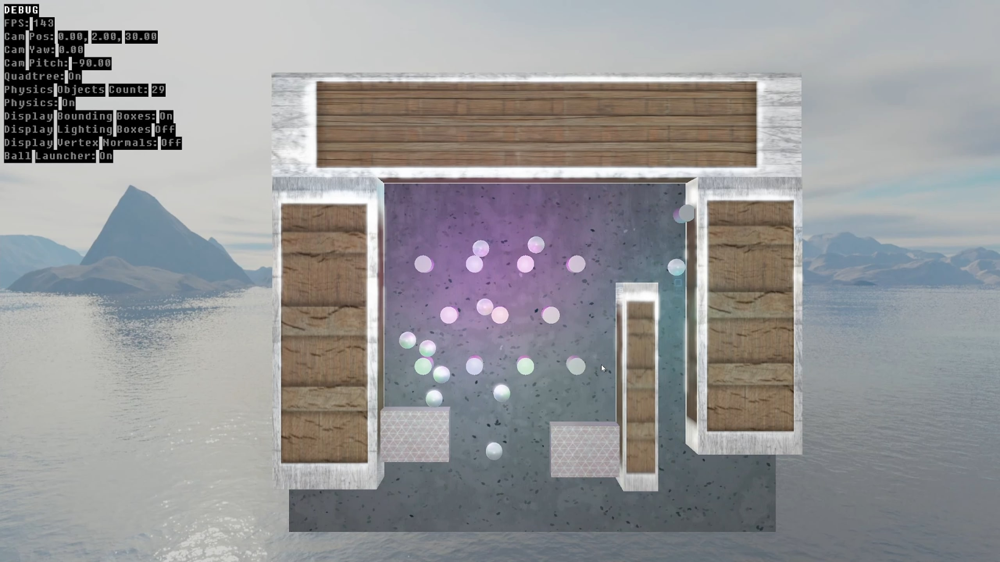
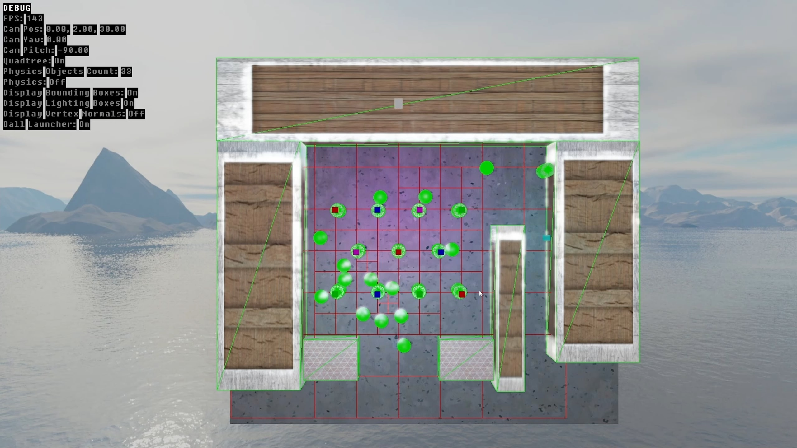

<h3 align="center">OpenGL Pinball</h3>

  

    OpenGL Pinball is a game made using SDL2 and OpenGL's rendering pipeline. 
     
    <a href="https://turtleteagames.com/projects/opengl_pinball">View Demo</a>
  

## About The Project

This project was created for my COSC1226: Real-Time Rendering and 3D Game Programming at RMIT. Contributions during this time are attributed under my RMIT student account - s3658051.

Besides SDL2 and the use of GLText for the HUD, this was made completely from scratch with custom shaders using GLSL. These shaders were used to apply the following effects:
- Render textured models such as spheres, cylinders and cubes with calculated and changeable vertices
- Bling phong lighting model on all objects from a directional light and multiple point lights
- Texture mapping
- A skybox implemented with a OpenGL cubemap
- Environmental mapping reflecting the skybox
- Specular and diffuse texture maps
- Particle effects with billboarding towards the camera
- Bloom effect applied to objects that reach a certain threshold of brightness

The physics used were also made from scratch and were calculated every rendering cycle of the program. These physics calculations include:
- A 2D Quadtree used as a spatial data structure in order to keep track of stationary and moving objects and optimise collision calculations
- Bounding volumes for circles and axially aligned boxes
- 2D Collision detection for circle/circle, circle/box and box/box for detecting if a block is inside a Quadtree section.

## Built With

- C/C++ - https://isocpp.org/
- SDL2 - https://www.libsdl.org/
- Glad - https://glad.dav1d.de/
- GLText - https://github.com/go-gl/gltext
- stb_image - https://github.com/nothings/stb
- OpenGL Mathematics (GLM) - https://github.com/g-truc/glm

## Linked Libraries

Required libraries can be found in the `Include` folder, and should already be linked.

## How To Build

Open the `.sln` file in Visual Studio and build (Ctrl+Shift+B). 

## How To Run

You can run the application from source in Visual Studio using the Local Windows Debugger, or by downloading the release and running the `OpenGL_Pinball.exe` file.

## Controls
- [ Space ]  - Launch ball. Small delay 0.1 second between launches
- [ < ] - Left Flipper. Applies force when rising
- [ > ] - Right Flipper. Applies force when rising
- [ B ] - Switch between normal and debug mode.
- [ Q ] - Toggle Between Quadtree and brute force physics comparisons
- [ H ] - Toggle Debug HUD

**Debug Controls**
- [ WASD ] - Move camera
- [ Arrow Keys ] - Pitch and Yaw camera
- [ Mouse Movement ] - Pitch and Yaw camera
- [ P ] - Pause and unpause physics
- [ L ] - Turn Light boxes off and on
- [ X ] - Turn display bounding boxes on and off
- [ N ] - Turn display vertex normals on and off